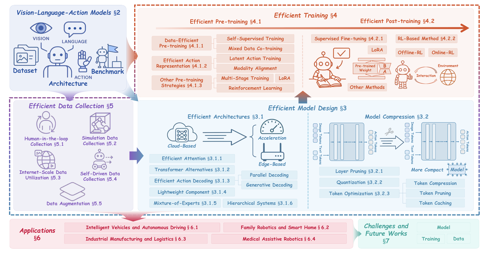








I am **Bo Wang**, a junior undergraduate student at the Guohao School of Tongji University, where I am enrolled in the Elite Class of Computer Science and Technology.

My research interests include Vision-Language-Action Models, World Models, Embodied AI, and Multimodal Learning.

If you are interested in related topics or potential collaborations, please feel free to get in touch: **2351563@tongji.edu.cn**.

# 🔥 News

- *2025.10*: 🎉🎉 We released [**A Survey on Efficient Vision-Language-Action Models**](https://arxiv.org/abs/2510.24795), the first comprehensive survey specifically dedicated to efficient Vision-Language-Action (VLA) models, and submitted it to *IEEE Transactions on Pattern Analysis and Machine Intelligence (TPAMI)*.

# 📝 Publications
Selected publications are listed below. For the full list, please see my [Google Scholar](https://scholar.google.com/citations?user=BZxc3a0AAAAJ&hl=zh-CN&authuser=1).

arXiv 2025

[**A Survey on Efficient Vision-Language-Action Models**](https://arxiv.org/abs/2510.24795) 
Zhaoshu Yu, **Bo Wang**, Pengpeng Zeng, Haonan Zhang, Ji Zhang, Zheng Wang, Lianli Gao, Jingkuan Song, Nicu Sebe, Heng Tao Shen 
Submitted to *IEEE Transactions on Pattern Analysis and Machine Intelligence* (**TPAMI**) 

  <a href="https://arxiv.org/abs/2510.24795">[Paper]</a>
  <a href="https://github.com/YuZhaoshu/Efficient-VLAs-Survey">[GitHub]</a>
  <a href="https://evla-survey.github.io/">[Website]</a>
  

# 📦 Repositories

  

    <h3 class="repo-card__title"><a href="https://github.com/YuZhaoshu/Efficient-VLAs-Survey">Efficient-VLAs-Survey</a></h3>
    
This is a curated list of research related to <em>A Survey on Efficient Vision-Language-Action Models</em>.

    

      
    

  

  

    <h3 class="repo-card__title"><a href="https://github.com/boboyoudiancai/Snaprop_Instant">Snaprop Instant</a></h3>
    
<em>Snaprop Instant</em> is a multimodal, all-in-one property value analysis system for intelligent real estate appraisal.

    

      
    

  

# 🎖 Honors and Scholarships

## Scholarships

- *2024.11*, 2024 Ningquan Research Scholarship.

## Honors

  

    

      

        

          
        

      

    

    

      
2025.03

      
Kaggle

      <h3 class="honor-card__title">Jigsaw - Agile Community Rules Classification</h3>
      
Silver Medal

    

  

  

    

      
2025.02

      
Kaggle

      <h3 class="honor-card__title">DRW - Crypto Market Prediction</h3>
      
Top 9% (the equivalent of silver medal)

    

  

  

    

      

        

          
        

      

    

    

      
2024.09

      
China International College Students' Innovation Competition

      <h3 class="honor-card__title">Shanghai Division</h3>
      
Silver Prize

    

  

  

    

      

        

          
        

      

    

    

      
2024.10

      
China International College Students' Innovation Competition

      <h3 class="honor-card__title">Beijing Division</h3>
      
Second Prize

    

  

  

    

      

        

          
        

      

    

    

      
2025.05

      
China Collegiate Computing Contest - Artificial Intelligence Innovation Competition

      <h3 class="honor-card__title">National Finals</h3>
      
First Prize

    

  

  

    

      

        

          
        

      

    

    

      
2025.04

      
China Collegiate Computing Contest - Artificial Intelligence Innovation Competition

      <h3 class="honor-card__title">East China Regional Competition</h3>
      
Second Prize

    

  

  

    

      

        

          
        

      

    

    

      
2025.06

      
Global Campus AI Algorithm Elite Competition

      <h3 class="honor-card__title">"Multimodal AIGC" Algorithm Track</h3>
      
Provincial First Prize

    

  

  

    

      

        

          
        

      

    

    

      
2025.07

      
Global Campus AI Algorithm Elite Competition

      <h3 class="honor-card__title">"Multimodal AIGC" Algorithm Track</h3>
      
National Second Prize

    

  

  

    

      

        

          
        

      

    

    

      
2024.08

      
ICAN Innovation and Entrepreneurship Competition

      <h3 class="honor-card__title">Shanghai Division</h3>
      
First Prize

    

  

  

    

      

        

          
        

      

    

    

      
2024.09

      
ICAN Innovation and Entrepreneurship Competition

      <h3 class="honor-card__title">National Finals</h3>
      
National Third Prize

    

  

  

    

      

        

          
        

      

    

    

      
2025.08

      
National AI Application Scenario Innovation Challenge

      <h3 class="honor-card__title">Intelligent Healthcare Track, Seed Group</h3>
      
Second Prize

    

  

  

    

      

        

          
        

      

    

    

      
2025.09

      
National AI Application Scenario Innovation Challenge

      <h3 class="honor-card__title">National Finals, Seed Group</h3>
      
Second Prize

    

  

  

    

      

        

          
        

      

    

    

      
2024.12

      
Tianjiaowan Cup Life and Health Innovation and Entrepreneurship Competition

      <h3 class="honor-card__title">4th Edition</h3>
      
Merit Award

    

  

  

    

      
2024.11

      
Tongji University Student Innovation Academic Forum

      <h3 class="honor-card__title">Growth Group</h3>
      
First Prize

    

  

  

    

      

        

          
        

      

    

    

      
2024.12

      
FLTRP "Guocai Cup" National English Debating Competition

      <h3 class="honor-card__title">National Competition</h3>
      
Second Prize

    

  

  

    

      
2024.10

      
FLTRP "Guocai Cup" English Debating Competition

      <h3 class="honor-card__title">Tongji University Preliminary</h3>
      
Third Place

    

  

  

    

      
2024.06

      
National College Student Digital Skills Application Competition (C++)

      <h3 class="honor-card__title">Preliminary Round</h3>
      
Third Prize

    

  

  

    

      
2024.05

      
National College Computer Ability Challenge

      <h3 class="honor-card__title">Provincial Competition</h3>
      
Second Prize

    

  

# 📖 Educations
- *2023.09 - 2027.06*, B.S., Computer Science and Technology, Tongji University.
